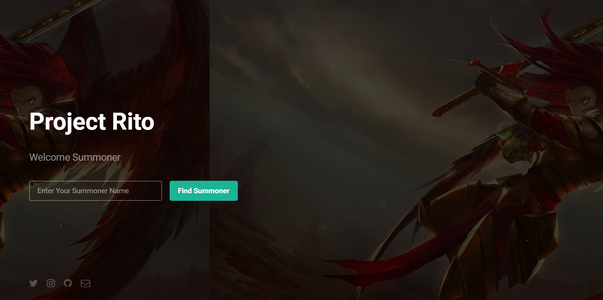
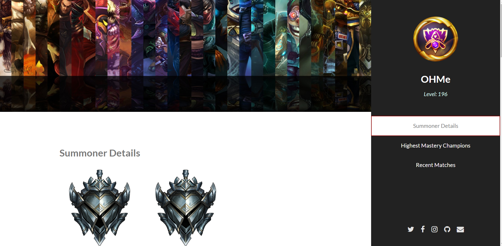
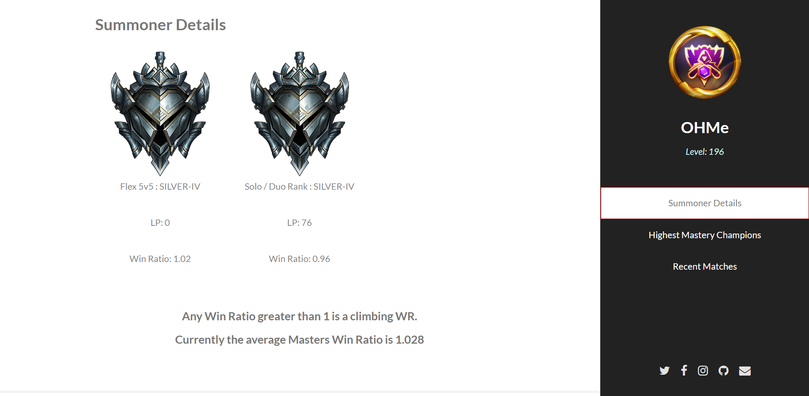
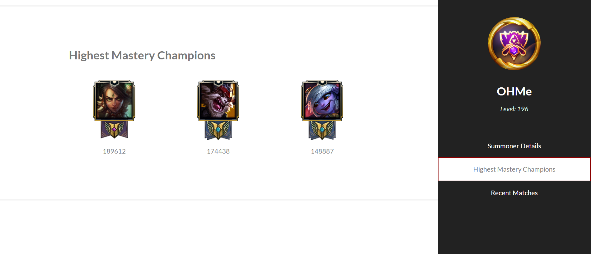
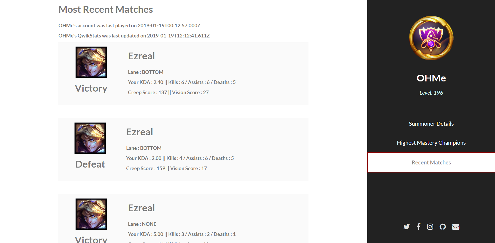

# Welcome To My Rito

## About Us

We're league enthusiasts with a passion for web development. 
We want to provide our fellow players with quick web/mobile access to their profile.
Our goal is to provide you with quick access to your summoner information.
As well as providing usefull insights into statistics and identify opportunities for improving your gameplay.
We're Deployed! [Check Us Out](https://my-react-rito.herokuapp.com/profile/ohme)
### Index
[Developer Section](#Developer-Section)

[Issues](#Issues)

[Examples](#Examples)

### Examples

### Developer-Section

#### Front-End Technologies

`React`, `html5-up`, `css`, `jquery`, `React-Dom`

#### Back-End Technologies

`express`, `node`, `request`, `dotenv`, `React-Dom-Router`, `express-session`

#### How To Help

If you're interested in helping or utilizing a local version you'll need to `clone` the repo and get your own API key from [Riot Developer](https://developer.riotgames.com/getting-started.html)
This requires a league of legends login currently so if you don't have one then start playing league of legends!
Once you have your API key and this repo cloned you'll need to use `node` and install the required `npm & yarn modules`.
Inside node where you cloned the repo `cd projectrito` then inside node run the command `yarn install`.
You'll then need to create a `.env` file and store your API key `RIOT_ID=Your_API_KEY`.
Once you do that you can launch a local version from node by using the command `yarn start`

#### Process

The user will provide a summoner name which will search our database and if no summoner is found it will triger the first API request. 
All consecutive API requests after require results from the initial API request.
We start by building the summoner object in the `searchController.js` file.
This `sum` object will be created for any summoner name that is searched.
We have to iterate through multiple static API routes in order to gather all the information we're looking to have.
Each API call adds child keys to the `sum` object to allow for simple DOM population through react states.
Once the API chain has completed the page will render the summoners profile page and store thier information into our database.
If our database has been updated within 10 minutes it will not perform an API request upon refresh or re-searching the summoner name. 
This is to limit the API call rates which is requested by Riot Games.

#### Issues

1. The API calls give us a lot of data; this has proven a challenge to convert the responses into SQL formatted storage.
	A. - Solution = We're going to build up the summoner object as much as possible then store it in JSON format.
2. The dynamic nature of each individual summoner profile.
	A. - Solution = `if` & `each` statements allow us to control DOM population depending on if the summoner has available data.
3. Promise-Hell; With every individual API request we have to await the response in order to move on to the next API request.
	A. - Solution = Function chain improves readability and problem solving in case of errors.
	B. - Final = Changed from handlebars to react.js in order to have individual components for each category of summoner data to help error handling and future updates. 
